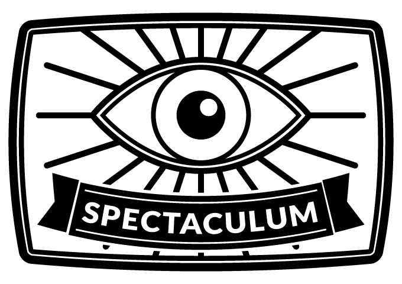
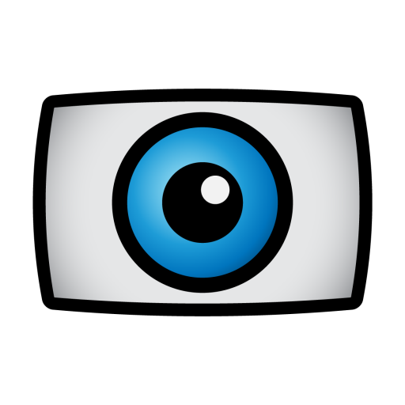

<center></center>

Spectaculum
===========

Spectaculum (*lat.* spectacle, show, sight) is a hardware accelerated view for visual
content on Android, from single pictures to 360° VR video.
It works with all sources that can write to a `Surface` or `SurfaceTexture`, e.g.
[MediaPlayer](https://developer.android.com/reference/android/media/MediaPlayer.html),
[MediaPlayer-Extended](https://github.com/protyposis/MediaPlayer-Extended),
[ExoPlayer](https://github.com/google/ExoPlayer),
[Camera](https://developer.android.com/reference/android/hardware/Camera.html), and
[Camera2 API](https://developer.android.com/reference/android/hardware/camera2/package-summary.html).
A [demo app](https://play.google.com/store/apps/details?id=net.protyposis.android.spectaculumdemo) is available on Google Play.


Features
--------

 * shader effects
 * zooming/panning
 * frame extraction
 * lightweight & no dependencies
 * 360° picture & video incl. stereo VR


Use cases
---------

 * Photo gallery / picture viewer (zooming & panning of image)
 * Camera apps (live preview, live shader effects, digital zoom, capturing of zoomed/effect-modified result)
 * Video players (image adjustments through shader effects, e.g. brightness/contrast)
 * 360°/immersive/VR content display/playback with sensor/gyroscope viewport


Requirements
------------

 * Android API 15+ (Android 4.0.3 Ice Cream Sandwich)


Changelog
---------

* __v1.0.0__: initial release


Usage
-----

Include `net.protyposis.android.spectaculum.SpectaculumView` into your layout, get a reference,
and attach a listener to the `InputSurfaceHolder` to get a reference to the `Surface` and `SurfaceTexture`.
They can then be passed to any component that draws onto them. Call `onPause` and `onResume` from the equivalent activity lifecycle methods. That's all.

```java
// Get reference to the Spectaculum view
SpectaculumView spectaculum = (SpectaculumView) findViewById(R.id.spectaculum);
// Attach input surface listener
spectaculum.getInputHolder().addCallback(new InputSurfaceHolder.Callback() {
    @Override
    public void surfaceCreated(InputSurfaceHolder holder) {
        // Use one of these to draw to the view
        Surface inputSurface = holder.getSurface();
        SurfaceTexture inputSurfaceTexture = holder.getSurfaceTexture();
    }
    @Override
    public void surfaceDestroyed(InputSurfaceHolder holder) {}
});
```

For self-contained subclasses that handle the drawing on their own, see the  [modules](#modules) below.

**Important**: `SpectaculumView` needs to receive the `onPause`/`onResume` lifecycle events from the activity it is part of:

```java
public class SpectaculumActivity extends Activity {
    private SpectaculumView mSpectaculum;
    public void onCreate(Bundle savedInstanceState) {
        mSpectaculum = (SpectaculumView) findViewById(R.id.spectaculum);
    }
    @Override
    protected void onPause() {
        super.onPause();
        mSpectaculum.onPause();
    }
    @Override
    protected void onResume() {
        super.onResume();
        mSpectaculum.onResume();
    }
}
```


### API

This is a quick overview of the most important methods.
Please check the JavaDoc for further explanation and the demo app for practical usage.

| Method                                            | Description |
| ------------------------------------------------- | ----------- |
| `setZoom(float)`                                  | Sets the zoom factor of the picture (1.0 is full screen, 2.0 is 200% magnification, etc.). |
| `getZoomLevel()`                                  | Gets the current zoom factor. |
| `setPan(float, float)`                            | Sets the panning of the zoomed picture into X and Y directions (0, 0 means center). |
| `getPanX()`                                       | Gets the current X panning. |
| `getPanY()`                                       | Gets the current Y panning. |
| `setTouchEnabled(boolean)`                        | Enables/disabled zoom and pan touch gestures. Disabled by default. |
| `isTouchEnabled()`                                | Checks if touch gestures are enabled. |
| `getInputHolder()`                                | Gets the InputSurfaceHolder that holds the surface to draw to. |
| `addEffect(Effect)`                               | Adds a shader effect that implements the `Effect` interface or `ShaderEffect` class. Async operation. See the demo app for an example on how to use and parameterize effects. Add and select the `NoEffect` effect to disable an active effect. |
| `selectEffect(int)`                               | Selects/activates a previously added effect by its index (in the order of effect addition). Async operation. |
| `setEffectEventListener(EffectEventListener)`     | Sets a listener to receive effect-related events. Useful to catch results of addEffect/selectEffect. |
| `setPipelineResolution(PipelineResolution)`       | Sets the resolution of the render pipeline according to the passed mode. Default is `SOURCE`. Check the `PipelineResolution` class for details. |
| `getPipelineResolution()`                         | Gets the current pipeline resolution setting. |
| `updateResolution(int, int)`                      | Sets the resolution of the input data and updates the view size in the layout. If no constant size is specified in the layout, the view adjusts its aspect ratio automatically to the input. |
| `captureFrame()`                                  | Requests the current frame to be captured and returned through the callback. Can be used to capture the processes picture, i.e. with effects applied. |
| `setOnFrameCapturedCallback(OnFrameCapturedCallback)` | Sets a callback that receives a captured frame as `Bitmap`. |
| `onPause()`                                       | Lifecycle method. Needs to be called from the according activity lifecycle method. |
| `onResume()`                                      | Lifecycle method. Needs to be called from the according activity lifecycle method. |


### Effects

Shader effects implement the `Effect` interface or one of the supplied abstract base classes
(`BaseEffect`, `ShaderEffect`) and apply their effect to a source texture that is written to a
target framebuffer (but all of this is handled by the effects framework).

`ShaderEffect` can be extended to create simple shader effects with a single shader program. Such
an effect consists of 3 components: a fragment shader (and optionally a vertex shader), a
`ShaderProgram` or almost always a `TextureShaderProgram`, and the `ShaderEffect`. The `ShaderEffect`
implements the `initShaderProgram()` method and initializes the `ShaderProgram` with a shader file (or string)
and sets up optional parameters.
Examples simple effects are the `SimpleToonEffect` (most basic effect without parameters)
and `ContrastBrightnessAdjustmentEffect` (basic effect with parameters).

Parameters can be added in the constructor or `initShaderProgram()`, depending on the use case.
A user of the effect can query the parameters at runtime and change them dynamically. For example,
the demo app dynamically constructs a panel overlay with all parameters that the user can directly adjust.
Parameters basically implement the `Parameter` interface, but usually extend the `BaseParameter` class.
There are four parameter implementations for basic data types available: `BooleanParameter`, `EnumParameter`,
`FloatParameter` and `IntegerParameter`.

Advanced effects can be implemented by directly extending `BaseEffect`. These effects are not
constrained to a single shader and can therefore contain multiple shader programs, textures,
framebuffers and subeffects and combine them to create complex effects.
See `FlowAbsEffect` and `QrMarkerEffect` for examples.

### 360° / Immersive / VR

Rendering 360° content is just another shader effect. To render equirectangular 360° content,
include the `Spectaculum-Effect-Immersive` module and apply the `EquirectangularSphereEffect`.
The effect is parameterized, and the first three float parameters control the rotation around
the X/Y/Z axes. The fourth parameter is an enum parameter of type `EquirectangularSphereEffect.Mode`,
which can be `MONO` for monocular content, or `STEREO_SBS`/`STEREO_TAB` for stereoscopic 3D content
in side by side or top and bottom layout. Unfortunately I cannot test the 3D modes due to lack of hardware.

Of course, a 3D VR view needs to change its viewport depending on where the consumer or device
is looking. The effect provides a `setRotationMatrix` method which accepts a 4x4 rotation matrix,
which is recommended for frequent updates over the XYZ parameters.

The module also includes a `SensorRotationNavigation` class that can be attached to the effect and
handles the sensor reading and viewport rotation automatically. When attaching it to the effect,
it adds a fifth boolean parameter that can be used to turn the sensor rotation on/off, default is off.
This class is **highly experimental** and does not work correctly yet, because I could not figure
out how to map the sensor coordinate system. Any help is appreciated!

### Maven

Release builds of the library are available in the
[JCenter](https://bintray.com/bintray/jcenter) Maven repository. Available versions are listed
in the [changelog](#changelog) or the [Bintray repository](https://bintray.com/protyposis/maven/spectaculum).

    repositories {
        ...
        jcenter()
    }

    dependencies {
        ...
        compile 'net.protyposis.android.spectaculum.spectaculum:1.0.0'
        compile 'net.protyposis.android.spectaculum.spectaculum-camera:1.0.0'
        compile 'net.protyposis.android.spectaculum.spectaculum-image:1.0.0'
        compile 'net.protyposis.android.spectaculum.spectaculum-mediaplayer:1.0.0'
        compile 'net.protyposis.android.spectaculum.spectaculum-mediaplayerextended:1.0.0'
        compile 'net.protyposis.android.spectaculum.spectaculum-effect-flowabs:1.0.0'
        compile 'net.protyposis.android.spectaculum.spectaculum-effect-immersive:1.0.0'
        compile 'net.protyposis.android.spectaculum.spectaculum-effect-qrmarker:1.0.0'
    }


Modules
-------

##### Spectaculum-Core

Just the main package. Contains `SpectaculumView` and a few shader effects.

##### Spectaculum-Camera

Contains `CameraView` which provides a live preview of the camera.
Adds methods `supportsCameraSwitch()` to check if the device has multiple cameras,
and `switchCamera()` to switch to the next camera (usually front to back / back to front).

##### Spectaculum-Image

Contains `ImageView` to display a bitmap through `setImageBitmap(Bitmap)`.

##### Spectaculum-MediaPlayer

Contains `VideoView`, a video playback view compatible with Android's
[VideoView](https://developer.android.com/reference/android/widget/VideoView.html).
It implements only a subset of Android's methods,
mostly playback control methods (e.g. subtitles are not supported).

##### Spectaculum-MediaPlayerExtended

Contains `MediaPlayerExtendedView`, a spectaculumized version of
[MediaPlayer-Extended](https://github.com/protyposis/MediaPlayer-Extended)'s VideoView,
which is also an API-compatible alternative to Android's VideoView
with enhanced functionality (playback speed adjustment, frame-exact seek, DASH playback).

##### Spectaculum-Effect-Immersive

Adds the `EquirectangularSphereEffect` for 360°/VR/3D content as described [above](#360-immersive-vr).

##### Spectaculum-Effect-FlowAbs ####

This module adds the [FlowAbs](https://code.google.com/p/flowabs/) shader effect and demonstrates
the possibility to construct and use very elaborate shader effects. It also offers various sub-effects
that the flowabs-effect is composed of, including (flow-based) difference of Gaussians,
color quantization and a tangent flow map. This is mostly a technical demo, not for productive use.

##### Spectaculum-Effect-QrMarker ####

This module is another example of an effect composed of multiple shaders. It is taken from
[QrMarker](https://github.com/thHube/QrMarker-ComputerVision) and provides a rather pointless and
very slow QR marker identification effect, and a nice Canny edge detection effect.
Again a technical demo, not for productive use.

#### Spectaculum-Demo ####

An app that demonstrates all the main functionality of the modules (different views and effects)
and serves as an example on how they can be used. Also contains example code on how to use
[MediaPlayer](https://developer.android.com/reference/android/media/MediaPlayer.html)
and [ExoPlayer](https://github.com/google/ExoPlayer) directly with `SpectaculumView`.

 Download the
[Spectaculum Demo](https://play.google.com/store/apps/details?id=net.protyposis.android.android.spectaculumdemo) from Google Play.


Known Issues
------------

* Effect-FlowAbs: The OrientationAlignedBilateralFilterShaderProgram / FlowAbsBilateralFilterEffect does
  not work correctly for some unknown reason and is deactivated in the FlowAbs effect, making it
  slightly less fancy

Device specific:

* Camera: preview aspect ratio is slightly off on the Nexus 7 2013 back camera (seems to be a system bug)
* Effect-FlowAbs: Not working on Tegra devices because shaders contain dynamic loops


License
-------

Copyright (C) 2014, 2015, 2016 Mario Guggenberger <mg@protyposis.net>.
Released under the Apache 2.0 license, except for `Spectaculum-Effect-FlowAbs` which is licensed under the GPLv3. Documentation and artwork licensed under CC BY-SA 4.0.
